# kiro2cc-proxy 源码阅读路线图：从零到精通

> 本文档是一份**学习路径指南**，专为想深入理解本仓库源码的新手编写。
> 它不重复讲解实现细节——细节请配合《[源码全景解析](源码全景解析.md)》与《[代码速查表](代码速查表.md)》食用；本文告诉你**按什么顺序读、每一步读什么、读到什么程度算过关**。
> 文中的文件清单、函数签名与行数均核对自当前仓库源码（Rust 侧约 1.5 万行，700+ 内联测试）。

> **图表查看方式**：下图在支持内嵌 SVG 的预览器（VS Code 预览 / Typora）中内联显示；不支持时请直接打开 [diagrams/01-reading-order.svg](diagrams/01-reading-order.svg)。

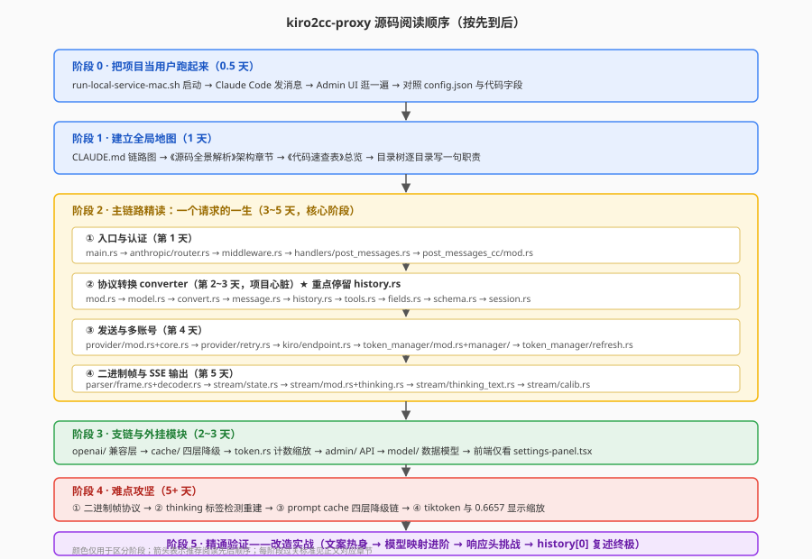

---

## 目录

- [阅读前置条件](#阅读前置条件)
- [总路线图：六个阶段](#总路线图六个阶段)
- [阶段 0：把项目当用户跑起来（0.5 天）](#阶段-0把项目当用户跑起来05-天)
- [阶段 1：建立全局地图（1 天）](#阶段-1建立全局地图1-天)
- [阶段 2：主链路精读——一个请求的一生（3~5 天）](#阶段-2主链路精读一个请求的一生35-天)
- [阶段 2.5：按功能精读源码（4+ 天）](#阶段-25按功能精读源码4-天)
- [阶段 3：支链与外挂模块（2~3 天）](#阶段-3支链与外挂模块23-天)
- [阶段 4：难点攻坚（5+ 天）](#阶段-4难点攻坚5-天)
- [阶段 5：精通验证——改造实战](#阶段-5精通验证改造实战)
- [附录 A：全量文件地图（按阅读优先级标注）](#附录-a全量文件地图按阅读优先级标注)
- [随读随查的工具箱](#随读随查的工具箱)
- [常见卡点与解法](#常见卡点与解法)

---

## 阅读前置条件

| 前置项 | 要求 | 不够熟的补救 |
|---|---|---|
| Rust 语言 | 读懂 `async/await`、`Arc/Mutex`、`Option/?`、trait、`serde` 派生宏即可入门；本仓库未用 Unsafe 与复杂生命周期魔法 | 过一遍 [Rust Book](https://doc.rust-lang.org/book/) 前 10 章即可开始，不必先成为高手 |
| HTTP 基础 | 知道请求/响应、Header、JSON、SSE（`data: {...}\n\n` 流式格式）是什么 | 看 MDN 的 SSE 词条，10 分钟 |
| Axum 框架 | 知道 Router、Handler、middleware 的分层即可 | 本仓库用法很标准，边读边学完全可行 |
| 工具链 | `cargo check / test / clippy` 能跑 | 见仓库 CLAUDE.md 常用命令 |

**心态提示**：本项目约 1.5 万行 Rust（含大量内联测试）。核心链路只涉及其中 ~6000 行，**不要试图一次读完**，按下面的阶段走，每个阶段都有明确出口。

---

## 总路线图：六个阶段

阅读先后顺序总览（详细说明见后续章节）：

```
阶段 0 跑起来 ──► 阶段 1 全局地图 ──► 阶段 2 主链路精读 ──► 阶段 3 支链模块 ──► 阶段 4 难点攻坚 ──► 阶段 5 改造实战
   当用户              认目录             一条请求的一生          周边外挂            硬核细节             动手证明
  (0.5 天)            (1 天)             (3~5 天)              (2~3 天)            (5+ 天)             (不限)
```

每阶段的「过关标准」都写在末尾。达标再进入下一阶段，不达标回头补。

---

## 阶段 0：把项目当用户跑起来（0.5 天）

**目标**：先当用户，再当作者。没跑过这个代理的人读源码会失去所有体感。

1. 按 README 用 `./run-local-service-mac.sh` 启动服务，走一遍配置向导
2. 用 Claude Code 接上代理发一条消息，观察终端输出
3. 打开 Admin UI（`/admin`），逛一遍：账号管理、请求日志、实时日志、设置页；若配置了子 Key，再逛 `/user` 用户面板
4. 在设置页把「思考内容文本化展示」（`thinkingAsText`）开关切一下，回终端看流式输出的差异
5. 看 `app/config/config.json` 与 `credentials.json` 的实际内容，和 `src/model/config.rs` 里的字段对上号（该文件每个字段都有中文 doc 注释，是配置的权威文档）
6. 观察启动日志：`main.rs` 里每启用一个能力都会打一行 info（Admin API、User UI、思考文本化、Suggestion Mode 等），这是后续读代码的「行为锚点」

**过关标准**：能说清「我在 Claude Code 里敲一句话，代理替我做了什么」的粗粒度版本。

---

## 阶段 1：建立全局地图（1 天）

**目标**：不求懂，只求**知道每样东西在哪**。此阶段禁止陷入任何函数细节。

### 1.1 读三份文档的定位章节

| 顺序 | 材料 | 读什么 |
|---|---|---|
| 1 | `CLAUDE.md` | 项目概述 + 请求链路图（ASCII 那张），背下来 |
| 2 | 《源码全景解析》 | 「项目概述」「目录结构」「架构全景」三章 |
| 3 | 《代码速查表》 | 只看「请求链路总览」，建立 文件 ↔ 职责 映射 |

### 1.2 对照目录树做「territory 标注」

拿一张纸或开个草稿，给每个目录写一句话职责（写不出来说明上面没读懂，回头重读）：

```
src/main.rs                服务启动：配置/凭证加载、环境变量覆盖、依赖总装、路由 nest
src/anthropic/             Anthropic 协议层：路由、认证中间件、协议转换、SSE 输出
  ├─ router.rs             端点总装：/v1/*、/cc/v1/*、/v1/ping、OpenAI 兼容路由
  ├─ middleware.rs         auth_middleware：API Key/子 Key 认证、RPM 计数、额度拦截、CORS
  ├─ types.rs              请求/响应数据类型（MessagesRequest、ContentBlock 等）
  ├─ handlers/             各 HTTP 端点入口（流式/非流式/模型列表/count_tokens/ping）
  ├─ converter/            Anthropic JSON → Kiro JSON 的翻译器（本项目心脏，16 个文件）
  └─ stream/               Kiro 事件流 → Anthropic SSE 的状态机（含思考文本化、回声防护）
src/kiro/                  Kiro 客户端层：HTTP 发送、多账号、token 刷新、二进制帧解析
  ├─ provider/             发送 + 重试 + 故障转移 + 错误分类 + 请求头构建
  ├─ token_manager/        OAuth token 刷新与多账号负载均衡（priority/balanced）
  ├─ parser/               AWS Event Stream 二进制帧解码（CRC32C 校验）
  ├─ endpoint.rs           4 个上游端点枚举 + (credential_id, endpoint) 限流桶
  └─ model/                Kiro 请求/事件的数据结构（conversation、events、credentials 等）
src/model/                 纯数据结构：config、api_key、usage、rpm、throttle_log、geo 等
src/openai/                外挂适配器：/v1/chat/completions 与 /v1/responses ↔ Anthropic 互转
src/cache/                 prompt cache 用量的四层降级估算 + 账号级前缀指纹追踪
src/token.rs               tiktoken cl100k_base 计数 + count_tokens 外部 API 客户端
src/common/                公共工具：认证工具函数、原子文件写入（跨设备 rename 降级）
src/admin/                 Admin REST API（32 条路由：账号/日志/统计/配置/子 Key 管理）
src/user/                  User REST API（子 Key 用户自助查询用量）
src/admin_ui/ + src/user_ui/  前端构建产物嵌入（rust-embed）
src/http_client.rs         带 proxy/TLS 后端选择的 reqwest 客户端工厂
src/log_capture.rs         环形缓冲实时日志捕获（供 Admin UI 实时日志页）
```

### 1.3 跑通两个验证命令

```bash
cargo test          # 700+ 个测试全绿，感受安全网
cargo check         # 注意编译速度，后面改代码要靠它快速反馈
```

**过关标准**：① 画出（或默写出）CLAUDE.md 那张链路图；② 任意说一个功能名词（如"429 限流""模型映射""回声防护"），能在 30 秒内说出它大概在哪个目录。

---

## 阶段 2：主链路精读——一个请求的一生（3~5 天）

**目标**：跟着一个 POST `/v1/messages` 请求从进门到出门走完全程。这是本文档的**核心阶段**，请逐文件精读，配合《源码全景解析》对应章节。

### 读法约定

- 每个文件先读文件头 `//!` 模块注释（本仓库每个模块都有高质量中文模块注释，这是刻意维护的）
- 遇到看不懂的函数，先看它的单元测试——本仓库测试有两种存放方式：同文件底部 `#[cfg(test)] mod tests`，以及集中式目录 `converter/tests/`、`stream/tests/`（按主题分文件）
- 用 `cargo test <名字>` 随跑随验

### 2.1 入口与认证（第 1 天）

| 顺序 | 文件 | 要回答的问题 |
|---|---|---|
| 1 | `src/main.rs`（~340 行） | 配置怎么加载？环境变量覆盖（`apply_env_overrides`）优先级？TokenManager、Provider、ApiKeyManager、FingerprintTracker 这些依赖怎么装配、谁持有谁？Admin/User 路由何时 nest？ |
| 2 | `src/anthropic/router.rs` | 端点全景：`/v1/ping`、`/v1/models`、`/v1/messages`、`/v1/messages/count_tokens`、`/v1/chat/completions`、`/v1/responses`、`/cc/v1/messages`；`/v1` 与 `/cc/v1` 差在哪？ |
| 3 | `src/anthropic/middleware.rs` | `auth_middleware` 的认证顺序（主 Key → 子 Key）？RPM 在哪计数（`RpmTracker`）？子 Key 额度检查在哪个环节拦截？`AppState` 聚合了哪些共享状态？ |
| 4 | `src/anthropic/handlers/post_messages.rs` | 直通流式的骨架：请求进来后先做什么、后做什么？转换发生在哪一行？ |
| 5 | `src/anthropic/handlers/post_messages_cc/mod.rs` | `/cc/v1` 的 300s 全局 deadline 加在哪、为什么只给这个端点加 |
| 6 | `src/anthropic/handlers/stream.rs` | 流式响应体怎么构造：`StreamContext` 怎么驱动、SSE `Body` 怎么从 Kiro 事件流生成 |
| 7 | `src/anthropic/handlers/nonstream.rs`（~720 行） | 非流式路径：怎么把流式事件聚合回一个完整 JSON 响应 |
| 8 | `src/anthropic/handlers/models.rs`（~510 行） | `/v1/models` 的模型清单从哪来、`model_cache_ttl_secs` 缓存什么 |
| 9 | `src/anthropic/handlers/count_tokens` 相关 + `error.rs` + `helpers.rs` | count_tokens 走本地估算还是外部 API？统一错误响应格式长什么样？ |

### 2.2 协议转换——converter（第 2~3 天，本项目心脏）

读 `src/anthropic/converter/`（16 个文件，是全仓库文件最多的模块），按此顺序：

| 顺序 | 文件 | 要回答的问题 |
|---|---|---|
| 1 | `mod.rs` | 子模块全景与拆分逻辑；`convert_request` 从哪进 |
| 2 | `result.rs`（~60 行） | `ConversionResult` / `ConversionError` 的形态——先认识"转换的产出物" |
| 3 | `model.rs` | 模型名关键词映射规则（sonnet/opus/haiku/gpt）；版本号（4.5/4.6/4.7/4.8/5）怎么决定代际；`thinking` 后缀怎么触发 extended thinking；未指定版本时 opus 兜底 4.6 |
| 4 | `convert.rs`（~270 行） | `convert_request` 主流程：current_message 与 history 怎么组装；`determine_chat_trigger_type` / `determine_agent_task_type` 怎么区分对话与 Agent 任务 |
| 5 | `message.rs` | `process_message_content`：text/image/tool_use/tool_result 四类内容块怎么提取；PDF 为什么要走本地提取 |
| 6 | `pdf.rs`（~105 行） | 未压缩 Tj/TJ 文本对象的 PDF 文本提取——为什么不给上游发原始 PDF |
| 7 | `prompt.rs`（~200 行） | `normalize_billing_header`（`cch=` → `0` 规范化）、`is_dynamic_hook_injection`（动态 hook 注入识别）、`append_output_format_instruction`、`append_recent_knowledge_hints`——这四个函数各自服务于 history[0] 稳定性的哪一条 |
| 8 | `history.rs`（~420 行，**全项目最关键的文件**） | `build_history`：history[0] 为什么必须逐字节稳定？`merge_user_messages` / `convert_assistant_message` / `merge_assistant_messages` 各解决什么合并问题？system-reminder 为什么原样保留在消息原位？ |
| 9 | `cache.rs`（~35 行） | 会话级 history[0] 冻结缓存基建：`CacheEntry`、`PREV_H0`、`evict_oldest_if_full` |
| 10 | `thinking.rs`（~130 行） | `generate_thinking_prefix`（thinking 前缀生成）、`gpt_anti_pseudo_tag_hint`（防 GPT 伪造标签的引导语）、`has_thinking_tags`、`is_gpt_model` |
| 11 | `tools.rs` | tool_use/tool_result 配对校验；工具描述的透传原则；历史上为什么删除过代理注入的工具描述后缀 |
| 12 | `websearch.rs`（~125 行） | `create_web_search_bridge_tool`：Anthropic server tool 格式的 web_search 怎么拆成 Kiro 可用的桥接工具；`create_placeholder_tool` 历史占位工具是干什么的 |
| 13 | `fields.rs` | `additionalModelRequestFields` 的「代际 × 字段」约束矩阵：`KIRO_MIN_MAX_TOKENS = 1024` 对全部 Claude 代际生效；`128_000`（1M 窗口代际 opus-5/4.7/4.8）与 `64_000`（sonnet 系）两档上限；"4.5" 代际整体跳过该字段的实测原因 |
| 14 | `schema.rs` | JSON Schema 规范化：$ref 展开、Kiro 严格模式清洗 |
| 15 | `session.rs` | conversationId 派生链：`extract_session_id`（从 user_id 提取）→ `derive_agent_continuation_id` → `derive_fallback_conversation_id`；`is_dynamic_hook_injection` 配合的 `collect_text_for_hash` |
| 16 | `tests/` 目录 | 浏览 `history_cache.rs`、`fields.rs`、`model.rs`、`websearch.rs` 等测试文件名，知道每个主题的测试在哪——以后改 converter 前先来这里找参照 |

**读 history.rs 时务必停留**。prompt cache 命中率是这个项目的生命线，而 history[0] 冻结是命中率的生命线。理解「任何进入 history[0] 的字节都必须跨请求稳定」这条铁律后，再回头看它如何约束了 `normalize_billing_header`、reminder 保留策略、标题生成隔离等设计——这也解释了 `prompt.rs`、`cache.rs`、`session.rs` 三个小文件为什么存在。

### 2.3 发送与多账号（第 4 天）

| 顺序 | 文件 | 要回答的问题 |
|---|---|---|
| 1 | `src/kiro/provider/mod.rs` | provider 模块导出什么、`KiroProvider` 的定位 |
| 2 | `src/kiro/provider/core.rs` | 一次发送的完整流程；builder 链（`with_proxy`/`with_rpm_tracker`/`with_throttle_log_store`/`with_failure_log_store`）；`client_for` 与 `semaphore_for`——全局并发 50 / 单账号并发 20 的 Semaphore 在哪生效；超时分档（普通 180s / compact 1000s） |
| 3 | `src/kiro/provider/api.rs` | 三个公开入口：`call_api` / `call_api_stream` / `call_mcp`（含 MCP 重试）——流式与非流式在 provider 层的分叉点 |
| 4 | `src/kiro/provider/retry.rs` | 每凭据 3 次 × 总共 9 次的重试策略；什么错误值得重试；重试怎么换下一个凭据 |
| 5 | `src/kiro/provider/errors.rs` | 错误分类与请求体改写：退避延迟怎么算、月度限额与 Profile ARN 错误怎么判定、什么情况下会改写请求体重试 |
| 6 | `src/kiro/provider/headers.rs` | `build_headers` / `build_mcp_headers`：请求头里带了哪些伪装字段 |
| 7 | `src/kiro/endpoint.rs` | `EndpointName` 四个枚举值（Ide / Runtime / Codewhisperer / Amazonq）对应 4 个上游端点；`EndpointBucketRegistry` 的 `(credential_id, endpoint)` 二元组隔离封禁（单次 429 封 30s）；`default_order` 的端点轮换顺序 |
| 8 | `src/kiro/token_manager/mod.rs` + `entry.rs` + `types.rs` | `MultiTokenManager` 的入口与数据形态：凭证条目、priority（默认）/ balanced 轮询负载均衡、粘性会话 |
| 9 | `src/kiro/token_manager/manager/`（core/admin_ops/reports/stats） | 管理器内部拆分：核心选号逻辑在 `core.rs`；Admin API 调用的账号操作在 `admin_ops.rs`（启用/禁用/优先级/余额/重置）；`stats.rs` 与 `reports.rs` 供统计报表 |
| 10 | `src/kiro/token_manager/refresh.rs` | OAuth 刷新流程、machine_id 派生、刷新后回写 credentials.json（注意单/多账号两种格式的回写差异） |

### 2.4 二进制帧与 SSE 输出（第 5 天）

| 顺序 | 文件 | 要回答的问题 |
|---|---|---|
| 1 | `src/kiro/parser/frame.rs` + `decoder.rs` | AWS Event Stream 帧结构：总长/头长/payload 的边界判定、CRC32C 校验范围 |
| 2 | `src/kiro/parser/header.rs` + `crc.rs` + `error.rs` | header 的 name/value 编码解析；CRC32C 查表实现；解析错误分类 |
| 3 | `src/anthropic/stream/state.rs` | SSE 状态机：事件类型怎么驱动状态迁移；`StreamContext` 怎么持有 usage 统计 |
| 4 | `src/anthropic/stream/mod.rs` + `helpers.rs` | Kiro 事件 → Anthropic SSE 事件的主映射；`SseEvent` 定义 |
| 5 | `src/anthropic/stream/thinking.rs` | thinking 标签怎么从文本流里检测和重建（为什么不能靠单个 `content_block` 事件） |
| 6 | `src/anthropic/stream/thinking_text.rs` | 思考文本化（v3.4.11 起默认开启）：`THOUGHT_HEADER = "> 💭 Thinking\n"` 常量；出站 `rewrite`（thinking 块 → dim 引用文本）与入站 `strip_rendered_thinking`（历史剥离）的双向识别；`is_claude_code_client` 为什么只对 Claude Code 客户端生效 |
| 7 | `src/anthropic/stream/echo_guard.rs`（~170 行） | 回声防护：模型偶发把用户消息里的 `<system-reminder>` 原文复述在回答开头时，最后一道关口怎么防御性剥离；流式场景怎么处理「标签前缀已到、闭合标签未到」的部分前缀等待 |
| 8 | `src/anthropic/stream/context/`（native.rs / tool_use.rs / metrics.rs） | StreamContext 的三个切面：原生 usage 透传、tool_use 事件聚合、流式指标 |
| 9 | `src/anthropic/stream/calib.rs` | usage 校准：`CLIENT_TOKEN_DISPLAY_SCALE = 0.6657` 显示缩放、`cap_input_tokens_pub` 输入封顶、`client_token_passthrough` 直通开关（Issue #44） |

**过关标准**：合上资料，能在白纸上画出「一个请求的一生」完整时序图，标注每个环节所在的文件名，并回答：
1. 为什么 history[0] 里要出现 `cch=0`？
2. 请求模型名 `claude-sonnet-4-5-thinking` 会被映射成什么？多了什么字段？
3. 上游返回 429 后，重试怎么选下一个凭据？封禁记录在哪个维度？
4. Kiro 的二进制帧从哪一步开始变成了 Anthropic SSE 的 `content_block_delta`？
5. 思考文本化开启后，同一轮对话的第二次请求里，上一轮的 thinking 内容去哪了？

---

## 阶段 2.5：按功能精读源码（4+ 天）

> 🔵 **本阶段的读法与阶段 2 互补**：阶段 2 按「一个请求的时间线」纵读，本阶段按「一个功能横跨哪些文件」横读。每个功能给出：功能链路说明 → 内部阅读顺序图（SVG）→ 文字阅读表。适合两种场景：① 想快速搞懂某个具体功能（如只为改 web_search）；② 阶段 2 读完后的复盘验证。

> **图表查看方式**：下图在支持内嵌 SVG 的预览器（VS Code 预览 / Typora）中内联显示；不支持时请直接打开 `docs/diagrams/` 下对应 svg 文件。

### 功能① 协议转换：Claude Code 请求 → Kiro 请求（★★★，阶段 2.2 的横切视角）

把 Anthropic Messages JSON 翻译成 Kiro 上游 JSON——本项目的心脏功能。阶段 2 按文件逐个读过，这里换成按「转换的步骤」串起来：

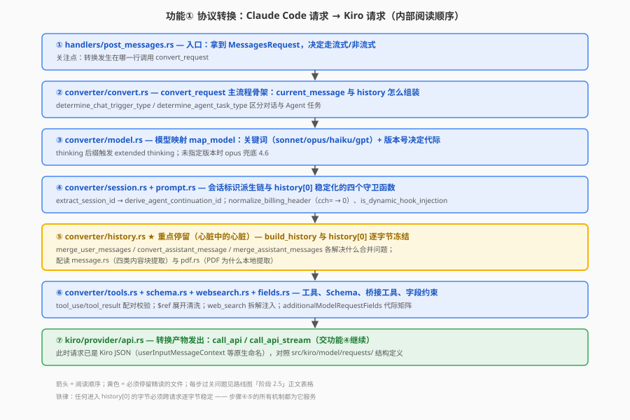

| 顺序 | 文件 | 要回答的问题 |
|---|---|---|
| 1 | `handlers/post_messages.rs` | 转换发生在哪一行？转换前后请求各长什么样？ |
| 2 | `converter/convert.rs` | `convert_request` 的步骤顺序：模型映射、消息组装、history 构建、字段注入各在什么时候发生？ |
| 3 | `converter/model.rs` | 我的请求模型名会被映射成哪个 Kiro 模型？依据什么规则？ |
| 4 | `converter/session.rs` + `prompt.rs` | conversationId 怎么派生？哪些函数在守护 history[0] 稳定？ |
| 5 | `converter/history.rs` ★ | 一条带 tool_use 的多轮对话怎么被合并进 history？为什么 history[0] 必须冻结？ |
| 6 | `tools.rs` / `schema.rs` / `websearch.rs` / `fields.rs` | 客户端的 tools 有哪些会被透传、哪些被改写？`additionalModelRequestFields` 给我的模型代际注入了什么？ |
| 7 | `kiro/provider/api.rs` | 最终发出的 Kiro 请求体在哪个函数里组装完成？ |

**过关标准**：拿一个真实的 Anthropic 请求 JSON（可用 `RUST_LOG=debug` 抓），手工标注每个字段在转换后变成了 Kiro 请求里的哪个字段、由哪个文件处理。

### 功能② web_search 桥接：Claude Code web_search → Kiro web_search（★★★）

Claude Code 发来的 `web_search` 是 Anthropic **server tool**（服务端执行，Kiro 上游没有对等实现）。本功能把它翻译成 Kiro 自己的 MCP 搜索：请求侧拆解注入 → 流式状态机截获 → 真实搜索 → 多轮续接。三个文件协作：

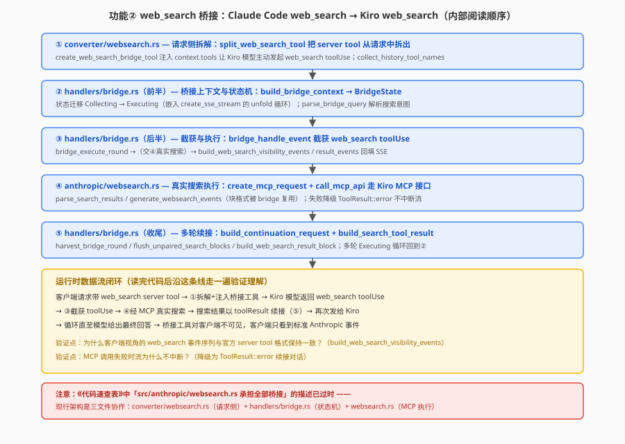

| 顺序 | 文件 | 要回答的问题 |
|---|---|---|
| 1 | `converter/websearch.rs` | `split_web_search_tool` 怎么把 server tool 拆出来？注入的「桥接工具」长什么样、模型为什么会被它引导发起搜索？ |
| 2 | `handlers/bridge.rs`（前半） | `BridgeState` 状态机挂在哪条流上（`create_sse_stream` 的 unfold）？Collecting 与 Executing 各在等什么？ |
| 3 | `handlers/bridge.rs`（后半） | `bridge_handle_event` 怎么从 Kiro 事件流里认出 web_search toolUse？截获后客户端此刻看到什么（visibility 事件）？ |
| 4 | `anthropic/websearch.rs` | `create_mcp_request` + `call_mcp_api` 怎么调 Kiro MCP 接口？搜索失败为什么降级为 `ToolResult::error` 而不是中断流？ |
| 5 | `handlers/bridge.rs`（收尾） | `build_continuation_request` 怎么把搜索结果作为 toolResult 续接下一轮？多轮循环何时终止？ |

**过关标准**：能画出一轮「请求 → 截获 → 搜索 → 续接 → 最终回答」的完整时序，并说清两个异常路径：MCP 失败降级、未配对的 search block 清洗（`flush_unpaired_search_blocks`）。

---

### 功能③ OpenAI 兼容层：/v1/chat/completions 与 /v1/responses（★★）

Codex CLI、任意 OpenAI SDK 客户端走这条外挂链路：把 OpenAI 请求翻译成 Anthropic Messages 请求后**复用 `anthropic::handlers::post_messages` 走完整下游**，再把响应转回 OpenAI 格式——不改 anthropic 模块任何实现。

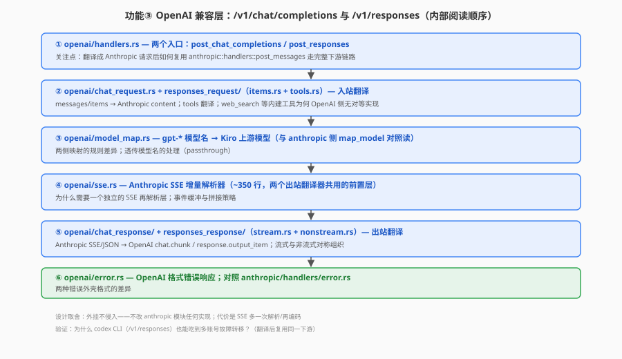

| 顺序 | 文件 | 要回答的问题 |
|---|---|---|
| 1 | `openai/handlers.rs` | `post_chat_completions` / `post_responses` 两个入口怎么复用 `post_messages`？为什么不侵入 anthropic 模块？ |
| 2 | `openai/chat_request.rs` + `responses_request/` | messages / items → Anthropic content 的翻译规则；tools 怎么翻；web_search 为何无对等实现？ |
| 3 | `openai/model_map.rs` | gpt-* 模型名 → Kiro 上游模型的映射规则，与 anthropic 侧 `map_model` 有何差异？ |
| 4 | `openai/sse.rs` | 为什么出站前需要一个独立的 Anthropic SSE 再解析层（~350 行）？ |
| 5 | `openai/chat_response/` + `responses_response/` | Anthropic SSE → OpenAI chat.chunk / response.output_item 的流式/非流式对称组织 |
| 6 | `openai/error.rs` | OpenAI 格式错误外壳与 Anthropic 格式的差异 |

**过关标准**：能说清「外挂不侵入」的设计取舍——好处（零回归风险）与代价（SSE 多一次解析/再编码），并解释 codex CLI 也能吃到多账号故障转移的原因。

---

### 功能④ 多账号故障转移与重试：一次 429 之后发生了什么（★★★）

上游 429 / 超时 / OAuth 过期时的完整自救链路：选号 → 发送 → 端点轮换 → 错误分类 → 重试换号 → token 补给 → 请求头伪装。

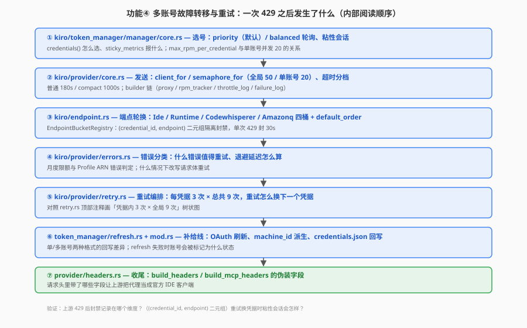

| 顺序 | 文件 | 要回答的问题 |
|---|---|---|
| 1 | `kiro/token_manager/manager/core.rs` | priority / balanced 两种轮询怎么选号？粘性会话（sticky session）何时生效、何时被打破？ |
| 2 | `kiro/provider/core.rs` | 全局并发 50 / 单账号 20 的 Semaphore 在哪取？超时为什么分 180s / 1000s 两档？ |
| 3 | `kiro/endpoint.rs` | 4 个端点对应 4 个独立限流桶；`(credential_id, endpoint)` 二元组封禁 30s 的注册表怎么工作？ |
| 4 | `kiro/provider/errors.rs` | 哪些错误值得重试、哪些直接失败？月度限额与 Profile ARN 错误怎么判定？ |
| 5 | `kiro/provider/retry.rs` | 每凭据最多 3 次 × 单请求总共 9 次的重试树；重试时怎么换下一个凭据？ |
| 6 | `token_manager/refresh.rs` + `mod.rs` | OAuth token 刷新、machine_id 派生、credentials.json 回写（单/多账号格式差异） |
| 7 | `kiro/provider/headers.rs` | 请求头里带了哪些伪装字段让上游认为是官方 IDE 客户端？ |

**过关标准**：能回答「上游 429 后封禁记录在哪个维度」「重试换凭据时粘性会话会怎样」，并手画 3×9 重试树。

---

### 功能⑤ 二进制帧 → SSE：Kiro 字节流怎么变成 Claude Code 的事件（★★★）

AWS Event Stream 二进制帧协议解码 + Anthropic SSE 状态机，是全项目最底层也最精密的一段。含 thinking 标签跨 chunk 重建、usage 校准等难点。

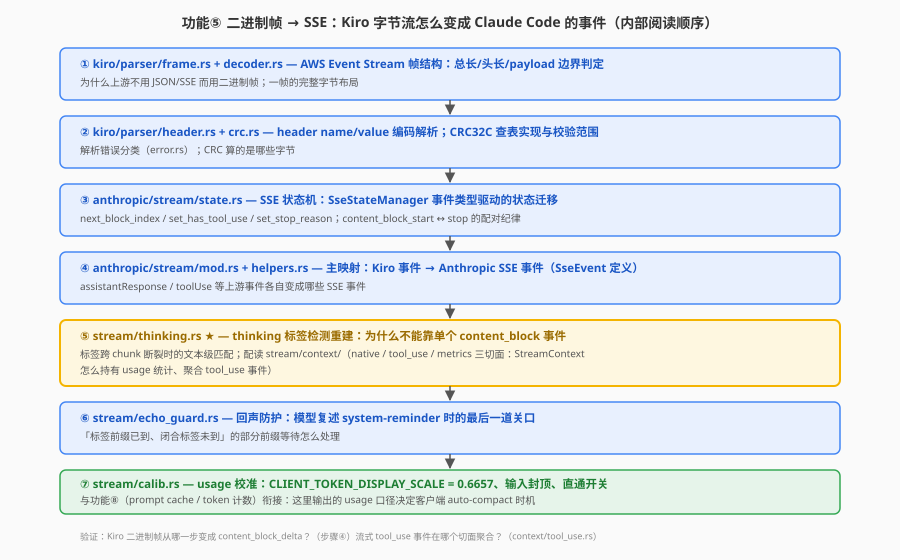

| 顺序 | 文件 | 要回答的问题 |
|---|---|---|
| 1 | `kiro/parser/frame.rs` + `decoder.rs` | 一帧的完整字节布局：总长/头长/payload 边界怎么判定？为什么上游不用 SSE？ |
| 2 | `kiro/parser/header.rs` + `crc.rs` | header name/value 编码解析；CRC32C 查表实现，校验的到底是哪些字节？ |
| 3 | `anthropic/stream/state.rs` | `SseStateManager` 的状态迁移：`next_block_index` / `set_has_tool_use` / `set_stop_reason`；content_block_start ↔ stop 的配对纪律 |
| 4 | `anthropic/stream/mod.rs` + `helpers.rs` | Kiro 事件（assistantResponse / toolUse…）各自映射成哪些 Anthropic SSE 事件？ |
| 5 | `anthropic/stream/thinking.rs` + `stream/context/` ★ | thinking 标签跨 chunk 断裂时的文本级检测重建；StreamContext 的 native / tool_use / metrics 三切面 |
| 6 | `anthropic/stream/echo_guard.rs` | 模型复述 system-reminder 时的回声防护；「前缀已到、闭合未到」怎么等待？ |
| 7 | `anthropic/stream/calib.rs` | usage 校准口径（衔接功能⑧）：输出给客户端的 input_tokens / cache_read 怎么定？ |

**过关标准**：能从原始字节讲到一个 `content_block_delta` 的完整旅程，并解释为什么 thinking 标签检测不能依赖单个 SSE 事件。

---

### 功能⑥ prompt cache 四层降级链：cache_read 数值从哪来（★★★）

Kiro 不返回 prompt cache 信息，代理自己算：metering 真值 → 前缀估算 → fingerprint 指纹 → 比例模拟，四层依次降级。命脉是 history[0] 逐字节冻结。

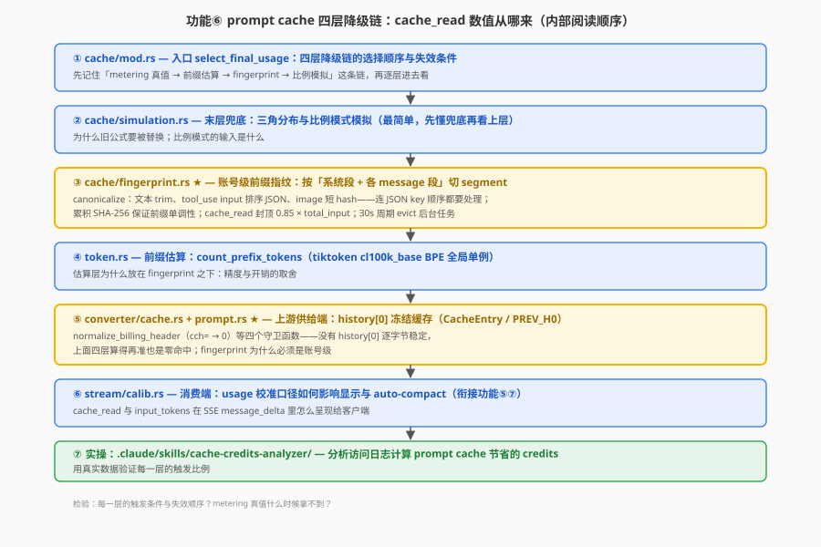

| 顺序 | 文件 | 要回答的问题 |
|---|---|---|
| 1 | `cache/mod.rs` | `select_final_usage` 的四层选择顺序与各层失效条件；metering 真值什么时候拿不到？ |
| 2 | `cache/simulation.rs` | 末层兜底：三角分布 / 比例模式怎么模拟？为什么要替换旧公式？ |
| 3 | `cache/fingerprint.rs` ★ | 账号级前缀指纹：canonicalize（文本 trim / tool_use 排序 JSON / image 短 hash）、累积 SHA-256 前缀单调性、cache_read 封顶 0.85×total_input、30s evict |
| 4 | `token.rs::count_prefix_tokens` | 第二层前缀估算（衔接功能⑨）；为什么放在 fingerprint 之下？ |
| 5 | `converter/cache.rs` + `prompt.rs` ★ | 供给端：`normalize_billing_header`（cch= → 0）等守卫函数怎么保证 history[0] 跨请求逐字节稳定？ |
| 6 | `stream/calib.rs` | 消费端：四层算出的 cache_read 在 SSE 里怎么呈现、如何影响 auto-compact？ |
| 7 | `.claude/skills/cache-credits-analyzer/` | 实操：用访问日志算出每层真实触发比例，验证 cache 节省的 credits |

**过关标准**：能解释「为什么 fingerprint 必须是账号级」「history[0] 漂移一字节会发生什么」，并说出四层的完整失效链。

---

### 功能⑦ 认证与额度入口：一个请求进门先被谁拦（★★）

主 Key / 子 Key 认证、RPM 计数、额度拦截全部发生在进入业务逻辑之前——这是理解用量统计与 Admin 配额体系的地基。

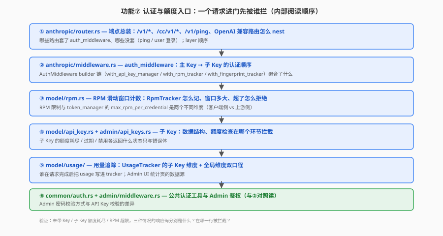

| 顺序 | 文件 | 要回答的问题 |
|---|---|---|
| 1 | `anthropic/router.rs` | 路由总装：哪些路由套了 `auth_middleware`、哪些没套（ping / user 登录）？layer 顺序？ |
| 2 | `anthropic/middleware.rs` | `auth_middleware` 的主 Key → 子 Key 认证顺序；builder 链聚合了 rpm_tracker / fingerprint_tracker / usage_tracker 什么能力？ |
| 3 | `model/rpm.rs` | RPM 滑动窗口怎么计数？与 token_manager 的 `max_rpm_per_credential` 是哪两个不同维度？ |
| 4 | `model/api_key.rs` + `admin/api_keys.rs` | 子 Key 数据结构；额度耗尽 / 过期 / 禁用各返回什么状态码与错误体？ |
| 5 | `model/usage/` | UsageTracker 的子 Key 维度 + 全局维度双口径；谁在请求完成后写入？ |
| 6 | `common/auth.rs` + `admin/middleware.rs` | Admin 密码校验与 API Key 校验的差异（对照读） |

**过关标准**：能回答未带 Key / 子 Key 额度耗尽 / RPM 超限三种情况的响应码，并指出各自被拦截的具体行号。

---

### 功能⑧ 思考文本化：thinking 内容以 > 💭 文本形式展示（★★）

Claude Code 不渲染 thinking block 时，代理把 thinking 改写成引用文本展示。核心是出站 rewrite 与入站 strip 的**双向互逆**不变量。

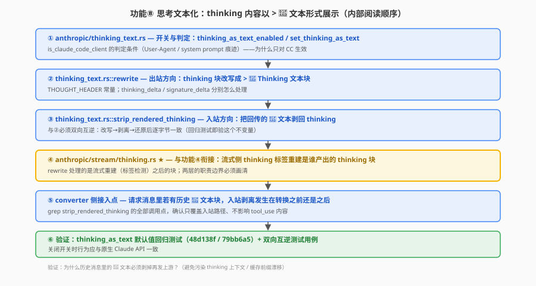

| 顺序 | 文件 | 要回答的问题 |
|---|---|---|
| 1 | `anthropic/thinking_text.rs` | `thinking_as_text_enabled` 开关与 `is_claude_code_client` 判定——为什么只对 Claude Code 生效？ |
| 2 | `thinking_text.rs::rewrite` | 出站：thinking 块 → `> 💭 Thinking` 文本块；THOUGHT_HEADER；thinking_delta / signature_delta 各怎么处理？ |
| 3 | `thinking_text.rs::strip_rendered_thinking` | 入站：把回传的 💭 文本剥回 thinking；为什么必须与②双向互逆（回归测试即验此不变量）？ |
| 4 | `anthropic/stream/thinking.rs` ★ | 衔接功能⑤：流式侧标签重建产出的 thinking 块与 rewrite 的职责边界 |
| 5 | converter 侧接入点 | grep `strip_rendered_thinking` 全部调用点：入站剥离发生在转换前还是后？为何不影响 tool_use 内容？ |
| 6 | 回归测试 | thinking_as_text 默认值测试（79bb6a5 / 48d138f）+ 双向互逆测试用例 |

**过关标准**：能解释「历史消息里的 💭 文本为什么必须剥掉再发上游」（避免污染 thinking 上下文 / 缓存前缀漂移）。

---

### 功能⑨ Token 计数与 0.6657 缩放：auto-compact 时机是怎么被「调」出来的（★★★）

`CLIENT_TOKEN_DISPLAY_SCALE = 0.6657` 是配合旧公式校准的显示缩放系数，直接控制客户端 auto-compact 触发时机——动 token 口径必看这里。

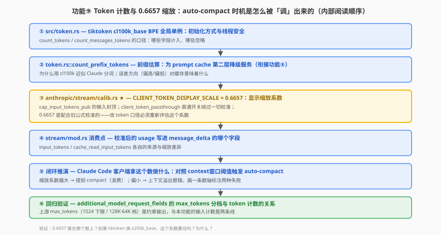

| 顺序 | 文件 | 要回答的问题 |
|---|---|---|
| 1 | `src/token.rs` | tiktoken cl100k_base BPE 全局单例的初始化与线程安全；count 口径：哪些字段计入？ |
| 2 | `token.rs::count_prefix_tokens` | 前缀估算（prompt cache 第二层，衔接功能⑥）；cl100k 近似 Claude 分词的误差方向？ |
| 3 | `stream/calib.rs` ★ | 0.6657 乘在哪个数上？`cap_input_tokens_pub` 输入封顶；`client_token_passthrough` 直通开关何时绕过一切校准？ |
| 4 | `stream/mod.rs` 消费点 | 校准后的 usage 写进 message_delta 哪个字段？input_tokens 与 cache_read 的缩放差异？ |
| 5 | 闭环推演 | 缩放系数偏大 → 提前 compact（浪费）；偏小 → 上下文溢出报错——在数轴上标出两种失败 |
| 6 | 回归验证 | 上游 `max_tokens` 分档（1024 下限 / 128K·64K 档）约束输出，与输入计数是两条线，别混淆 |

**过关标准**：能说出如果 tiktoken 换 o200k_base，0.6657 是否需要重新校准、以及为什么。

---

### 功能⑩ Admin/User API 与配置持久化：改一个配置项之后发生了什么（★★）

Admin UI 上点一下「保存」之后：鉴权 → 白名单校验 → 内存 Config 更新 → 热组件通知 → 原子落盘。

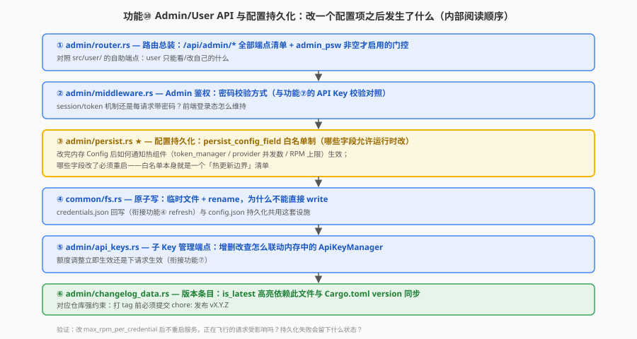

| 顺序 | 文件 | 要回答的问题 |
|---|---|---|
| 1 | `admin/router.rs` | /api/admin/* 全部端点清单；`admin_psw` 非空才启用的门控；对照 `src/user/` 自助端点能改什么 |
| 2 | `admin/middleware.rs` | Admin 鉴权方式（密码校验 / session），与功能⑦的 API Key 校验对照 |
| 3 | `admin/persist.rs` ★ | `persist_config_field` 白名单制：哪些字段允许热改、哪些必须重启——白名单本身就是热更新边界清单；改完怎么通知 token_manager / 并发数 / RPM 上限生效？ |
| 4 | `common/fs.rs` | 原子写（临时文件 + rename）：为什么不能直接 write？credentials.json 回写共用这套设施 |
| 5 | `admin/api_keys.rs` | 子 Key 增删改查怎么联动内存 ApiKeyManager？额度调整立即生效还是下请求生效？ |
| 6 | `admin/changelog_data.rs` | 版本条目与 `is_latest` 高亮；对应仓库强约束「打 tag 前必须同步 version」 |

**过关标准**：能回答「改 max_rpm_per_credential 后不重启，飞行中的请求受影响吗」「持久化失败会留下什么状态」。

---

## 阶段 3：支链与外挂模块（2~3 天）

**目标**：补齐主链路之外的板块，理解「外挂不侵入」的设计取舍。

### 3.1 OpenAI 兼容层（★★，`src/openai/`）

入口 `handlers.rs`。两个入站翻译器 + 两个出站翻译器，对称组织：

| 文件 | 职责 |
|---|---|
| `chat_request.rs` | `/v1/chat/completions` 请求 → Anthropic Messages 请求 |
| `chat_response/`（stream.rs + nonstream.rs） | Anthropic SSE / JSON → OpenAI chat 响应 |
| `responses_request/`（items.rs + tools.rs） | `/v1/responses`（Codex CLI 用）的 items 与 tools 翻译 |
| `responses_response/`（stream.rs + nonstream.rs） | Responses API 的流式/非流式响应 |
| `sse.rs`（~350 行） | Anthropic SSE 增量解析器——两个出站翻译器共用的前置层 |
| `model_map.rs` | OpenAI 模型名（gpt-*）→ Kiro 上游模型名映射 |
| `error.rs` | OpenAI 格式的错误响应 |

关注点：请求翻译后**复用** `post_messages` 走完整下游链路，响应再转回 OpenAI 格式；代价是 SSE 多一次解析/再编码——这是有意取舍，不改动 anthropic 模块任何实现。

### 3.2 cache 用量估算（★★，`src/cache/`）

| 文件 | 职责 |
|---|---|
| `mod.rs` | `select_final_usage`：四层降级链选择终值——metering 真值 → `token::count_prefix_tokens` 前缀字符估算 → fingerprint 指纹追踪 → 比例模拟 |
| `fingerprint.rs` | 账号级前缀指纹：按「系统段 + 各 message 段」切 segment，canonicalize（文本 trim、tool_use input 排序 JSON、image 短 hash），累积 SHA-256 保证前缀单调性，命中段刷新 `last_hit_at`；`cache_read` 封顶 0.85 × total_input；30s 周期 evict 后台任务 |
| `simulation.rs` | 三角分布与比例模式模拟（旧末层兜底） |

### 3.3 Token 计数（★★，`src/token.rs`）

tiktoken cl100k_base BPE 全局单例；`init_config` 支持可选的外部 count_tokens API（`count_tokens_api_url/key/auth_type`）；`CLIENT_TOKEN_DISPLAY_SCALE`（0.6657）显示缩放与 auto-compact 触发时机的关系在阶段 4 难点④展开。

### 3.4 Admin / User API（★）

| 文件 | 职责 |
|---|---|
| `src/admin/router.rs` | 32 条路由的组织：凭证管理、日志、统计、配置、子 Key |
| `src/admin/handlers.rs` | 各端点实现；`persist_config_field` 原子写配置（依赖 `common/fs.rs` 的跨设备 rename 降级） |
| `src/admin/middleware.rs` + `common/auth.rs` | Admin 鉴权与公共认证工具 |
| `src/admin/api_keys.rs` | 子 Key（多用户 API Key）管理后端 |
| `src/admin/changelog.rs` + `changelog_data.rs` | 版本更新日志 API；`changelog_data.rs` 里的版本条目与 `is_latest` 高亮直接相关（发版必改，见 CLAUDE.md 纪律） |
| `src/admin/log_handler.rs` + `service.rs` + `types.rs` | 日志查询、服务层封装、DTO |
| `src/user/` | 子 Key 用户自助端点：`POST /api/user/login`、`GET /api/user/usage` |

### 3.5 数据模型与基础设施（★）

| 文件 | 职责 |
|---|---|
| `src/model/usage/` | 用量统计口径（子 Key 维度 + 全局维度） |
| `src/model/rpm.rs` | RPM 滑动窗口计数 |
| `src/model/throttle_log.rs` + `failure_log.rs` | 限流/失败事件的持久化日志（`throttle_log.json` / `failure_log.json`） |
| `src/model/geo.rs` | IP 归属地解析（Admin UI 展示用） |
| `src/model/arg.rs` + `api_key.rs` | CLI 参数、API Key 数据结构 |
| `src/common/fs.rs` | 原子写文件 + 跨设备 rename 失败降级 |
| `src/log_capture.rs` | 1000 条容量环形缓冲实时日志 |

### 3.6 前端（☆）

`web-ui/admin-ui/src/`（React + Vite，pnpm 构建）：只需看懂 `settings-panel.tsx` 一个页面与 hooks 的数据流即可；i18n 文案在 `src/i18n/locales/{zh,en}.json`。`web-ui/user-ui`（npm 构建）同理无需深入。

**过关标准**：能说清 OpenAI 兼容层「为什么不改 anthropic 模块任何代码也能工作」，以及这样设计的代价。

---

## 阶段 4：难点攻坚（5+ 天）

**目标**：啃下最硬的五块骨头。每块都有专门章节，读懂后你的理解将超过绝大多数贡献者。

| 难点 | 材料 | 检验自己 |
|---|---|---|
| ① AWS Event Stream 二进制协议 | 《源码全景解析》难点 1 + `parser/` 源码 + 测试 | 手算一个简单帧的 CRC32C 输入范围；说清 header 与 payload 的边界判定 |
| ② thinking 标签检测与重建 + 思考文本化 | 难点 2 + `stream/thinking.rs` + `stream/thinking_text.rs` | 为什么不能靠单个 `content_block` 事件、必须做文本级标签匹配？`THOUGHT_HEADER` 出站改写与入站剥离为什么必须严格互逆？ |
| ③ prompt cache 四层降级链 | 难点 4~6 + `src/cache/` + `converter/cache.rs` + `converter/prompt.rs` | 每一层的触发条件与失效顺序；fingerprint 为什么是账号级；canonicalize 为什么连 tool_use input 的 JSON key 顺序都要处理 |
| ④ history[0] 冻结与 system-reminder 策略 | `converter/history.rs` + `converter/prompt.rs` + 《源码全景解析》 + 相关 git log（commit a3e08ea / 4ef12db 是重要历史节点） | 为什么 reminder 必须原位保留而不是抽走再注入？动态 hook 注入（`is_dynamic_hook_injection`）为什么不冻结进 history[0]？ |
| ⑤ tiktoken 与显示缩放 | 难点 7~8 + `src/token.rs` + `stream/calib.rs` | 0.6657 这个系数校准的是什么？改动 token 口径前要评估什么（auto-compact 触发时机）？ |

**学习方法**：先读文档建立直觉 → 再读源码验证直觉 → 最后改一改测试里的边界用例看会不会红。三步走完才算攻克。

**过关标准**：能向另一个人（或 AI）完整讲清任一难点，对方追问三层不露怯。

---

## 阶段 5：精通验证——改造实战

**目标**：读懂的最好证明是改对。按难度递增做以下练习（从易到难）：

1. **热身**：给 Admin UI 设置页的某个配置项描述文案改一个错别字，`pnpm build` 后重跑验证（涉及 `web-ui/admin-ui/src/i18n/locales/{zh,en}.json` + 前端构建）
2. **进阶**：为 `converter/model.rs` 新增一个模型关键词映射，并补齐单元测试（参照现有测试写，跑 `cargo test map_model`）
3. **挑战**：给 `/v1/messages` 的响应加一个自定义响应头（需要动 `handlers/stream.rs`，注意不要破坏 SSE 事件序列），补测试
4. **硬核**：给 `converter/websearch.rs` 的占位工具补一个新场景的 tool_use/tool_result 配对测试（先读懂 `tools.rs` 的配对校验规则）
5. **终极**：理解并复述一遍「如果要把 history[0] 冻结策略改成每轮刷新，需要动哪些文件、会破坏什么」——本题不需要真改，能完整说出破坏面（Kiro prompt cache 全量失效、fingerprint 串槽、`converter/cache.rs` 的 `PREV_H0` 语义作废……）即算精通

每个练习都遵守项目纪律：`cargo fmt` + `cargo clippy` clean、公开行为变更补内联测试、commit 遵循 Conventional Commits（中文）。

---

## 附录 A：全量文件地图（按阅读优先级标注）

主链路文件优先级 ⭐⭐⭐（阶段 2 必读）、支链 ⭐⭐（阶段 3）、按需 ⭐（用到再查）。

### src/anthropic/

| 文件 | 一句话职责 | 优先级 |
|---|---|---|
| `router.rs` | 端点总装与 nest | ⭐⭐⭐ |
| `middleware.rs` | 认证 / RPM / 额度拦截 / CORS | ⭐⭐⭐ |
| `types.rs` | Anthropic 协议数据类型 | ⭐⭐⭐ |
| `handlers/post_messages.rs` | 直通流式入口 | ⭐⭐⭐ |
| `handlers/post_messages_cc/mod.rs` | /cc/v1 + 300s deadline | ⭐⭐⭐ |
| `handlers/stream.rs` | SSE 响应体构造 | ⭐⭐⭐ |
| `handlers/nonstream.rs` | 非流式聚合（~720 行） | ⭐⭐ |
| `handlers/models.rs` | 模型列表 + TTL 缓存（~510 行） | ⭐⭐ |
| `handlers/error.rs` / `helpers.rs` / `ping.rs` | 统一错误 / 公共助手 / 健康检查 | ⭐ |
| `converter/history.rs` | history[0] 冻结（~420 行，心脏中的心脏） | ⭐⭐⭐ |
| `converter/convert.rs` | convert_request 主流程 | ⭐⭐⭐ |
| `converter/model.rs` | 模型映射 | ⭐⭐⭐ |
| `converter/message.rs` | 内容块提取 | ⭐⭐⭐ |
| `converter/fields.rs` | 代际×字段约束矩阵 | ⭐⭐⭐ |
| `converter/tools.rs` | 工具配对校验 | ⭐⭐⭐ |
| `converter/schema.rs` | JSON Schema 规范化 | ⭐⭐⭐ |
| `converter/session.rs` | conversationId 派生链 | ⭐⭐⭐ |
| `converter/prompt.rs` | cch= 规范化 / 注入识别 / 提示注入 | ⭐⭐⭐ |
| `converter/thinking.rs` | thinking 前缀与 GPT 反伪标签 | ⭐⭐ |
| `converter/cache.rs` | history[0] 冻结缓存基建 | ⭐⭐ |
| `converter/websearch.rs` | web_search 桥接工具 | ⭐⭐ |
| `converter/pdf.rs` | PDF 本地文本提取 | ⭐⭐ |
| `converter/result.rs` | 转换结果/错误类型 | ⭐⭐ |
| `converter/tests/` | 按主题集中的转换测试（10 个文件） | ⭐⭐ |
| `stream/state.rs` | SSE 状态机 | ⭐⭐⭐ |
| `stream/mod.rs` + `helpers.rs` | 事件主映射 | ⭐⭐⭐ |
| `stream/thinking.rs` | thinking 标签检测重建 | ⭐⭐⭐ |
| `stream/thinking_text.rs` | 思考文本化双向识别 | ⭐⭐⭐ |
| `stream/echo_guard.rs` | 回声防护（~170 行） | ⭐⭐ |
| `stream/calib.rs` | usage 校准与显示缩放 | ⭐⭐⭐ |
| `stream/context/` | native / tool_use / metrics 三切面 | ⭐⭐ |

### src/kiro/

| 文件 | 一句话职责 | 优先级 |
|---|---|---|
| `provider/core.rs` | 发送流程 + 并发 Semaphore + 超时分档 | ⭐⭐⭐ |
| `provider/retry.rs` | 3×9 重试策略 | ⭐⭐⭐ |
| `provider/api.rs` | call_api / call_api_stream / call_mcp 入口 | ⭐⭐⭐ |
| `provider/errors.rs` | 错误分类 / 退避 / 请求体改写 | ⭐⭐⭐ |
| `provider/headers.rs` | 请求头构建 | ⭐⭐ |
| `endpoint.rs` | 4 端点 + 限流桶注册表 | ⭐⭐⭐ |
| `token_manager/mod.rs` + `entry.rs` + `types.rs` | 多账号管理与凭证数据形态 | ⭐⭐⭐ |
| `token_manager/manager/core.rs` | 选号核心逻辑 | ⭐⭐⭐ |
| `token_manager/manager/admin_ops.rs` | Admin 账号操作 | ⭐⭐ |
| `token_manager/manager/stats.rs` + `reports.rs` | 统计与报表 | ⭐ |
| `token_manager/refresh.rs` | OAuth 刷新与回写 | ⭐⭐⭐ |
| `parser/frame.rs` + `decoder.rs` | 二进制帧解码 | ⭐⭐⭐ |
| `parser/header.rs` + `crc.rs` + `error.rs` | header 解析 / CRC32C / 错误 | ⭐⭐ |
| `model/` | Kiro 协议数据结构（requests/events/credentials） | ⭐⭐⭐ |

### 其他

| 文件 | 一句话职责 | 优先级 |
|---|---|---|
| `src/main.rs` | 启动总装 | ⭐⭐⭐ |
| `src/model/config.rs` | 配置权威文档（中文 doc 注释） | ⭐⭐⭐ |
| `src/openai/`（9 个子模块） | OpenAI 兼容外挂层 | ⭐⭐ |
| `src/cache/`（3 个文件） | 四层降级 + 指纹追踪 | ⭐⭐ |
| `src/token.rs` | tiktoken 计数 | ⭐⭐ |
| `src/admin/`（11 个文件） | Admin REST API | ⭐ |
| `src/user/` | 子 Key 用户自助 API | ⭐ |
| `src/model/` 其余 | usage / rpm / throttle_log / geo / failure_log | ⭐ |
| `src/common/` | 认证工具 / 原子写文件 | ⭐ |
| `src/http_client.rs` / `log_capture.rs` | HTTP 客户端工厂 / 实时日志缓冲 | ⭐ |

---

## 随读随查的工具箱

| 需求 | 手段 |
|---|---|
| 查某功能在哪实现 | 《代码速查表》（功能 → 位置映射）+ 本文档附录 A |
| 看某模块设计动机 | 《源码全景解析》对应章节（含 8 个难点攻坚） |
| 看某函数怎么用 | 同文件底部的 `#[cfg(test)] mod tests` 或 `converter/tests/`、`stream/tests/` 主题测试目录，本仓库 700+ 测试几乎覆盖所有公开函数 |
| 快速类型检查 | `cargo check`（增量约 2~7 秒） |
| 跑单组测试 | `cargo test <名字子串>`，如 `cargo test additional_model_request_fields` |
| 看运行时行为 | `RUST_LOG=debug cargo run`，日志会标注各环节（`[exp2]`、`[RULE-DIAG]` 等标记可直接全文搜索源码定位） |
| 查配置字段含义 | `src/model/config.rs`——每个字段都有中文 doc 注释，是配置的权威文档 |
| 查某 HTTP 端点由哪个函数处理 | `src/anthropic/router.rs` 与 `src/admin/router.rs` 的 route 注册表 |
| 查模型映射规则 | `converter/model.rs`（Anthropic 侧）+ `openai/model_map.rs`（OpenAI 侧） |
| 分析 prompt cache 收益 | `.claude/skills/cache-credits-analyzer/` skill |

---

## 常见卡点与解法

| 卡点 | 解法 |
|---|---|
| converter 里字段名太长、结构嵌套太深 | 这是 Kiro 上游协议的原生命名（如 `userInputMessageContext`），不要重命名；画个 JSON 结构图对照读，结构定义在 `src/kiro/model/requests/` |
| 分不清「代理注入」与「客户端原始」内容 | 看 `converter/history.rs` 与 `converter/prompt.rs` 的模块注释；历史上踩过的坑都记录在 git log 与《源码全景解析》里 |
| 看不懂 provider 的重试层数 | 先读 `src/kiro/provider/retry.rs` 顶部注释画出「凭据内 3 次 × 全局 9 次」的树状图，再对照代码 |
| 不理解为什么有的测试在文件底部、有的在独立目录 | 单文件小测试内联；converter/stream 这类大模块集中在 `tests/` 子目录按主题分文件（如 `converter/tests/history_cache.rs`） |
| thinking_text 的改写/剥离对不上 | 两边必须严格互逆：出站加 `THOUGHT_HEADER` + dim 转义，入站先去 dim 转义再比对 header；任何一侧单独改都会导致历史剥离失败或误剥正文 |
| SSE 事件顺序错乱难调试 | `src/anthropic/stream/state.rs` 的状态机先画状态转移图；测试里有完整的事件序列断言可参考 |
| 改了代码测试大量变红 | 多半破坏了 history[0] 稳定性或 tool_use/tool_result 配对等不变量——看失败测试的 assert 消息，它们被刻意写得可诊断 |
| 前端 dist 缺失导致 release 构建失败 | 先 `cd web-ui/admin-ui && pnpm install && pnpm build`（admin-ui 用 pnpm；user-ui 用 npm），见 CLAUDE.md |

---

> 最后一条建议：这个仓库的注释密度很高，而且**注释里写着「为什么」而不是「是什么」**。
> 读到任何反直觉的设计时，先找它旁边的注释和测试；如果注释和代码冲突，以代码为准并视为一个值得提 issue 的 bug。
